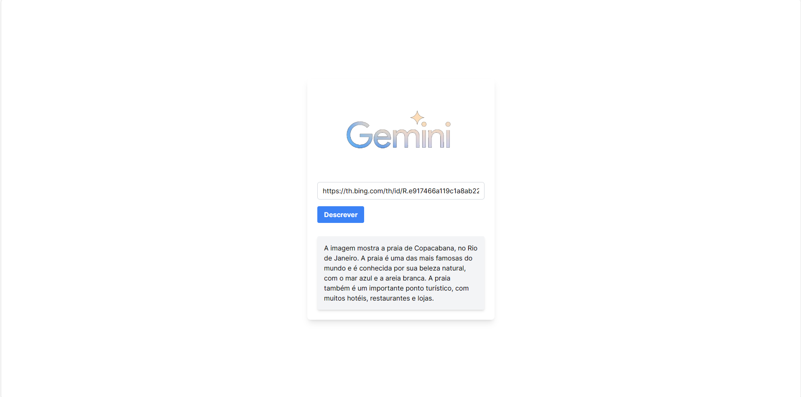

# Descrição de Imagem com Next.js, Tailwind CSS e Gemini API



Acabei de concluir um projeto empolgante onde utilizei as mais recentes tecnologias web para criar um sistema inovador de descrição de imagens!

Com a ajuda do Next.js, Tailwind CSS e a poderosa API do Gemini, desenvolvi uma plataforma capaz de analisar e descrever imagens de forma automatizada. Imagine poder extrair informações úteis de imagens em questão de segundos!

Este projeto não só me permitiu aprimorar minhas habilidades de desenvolvimento web, mas também me abriu os olhos para o incrível potencial da inteligência artificial e da visão computacional.

## Para Fins de Estudo

Este projeto foi desenvolvido para fins de estudo e aprendizado. Durante o processo, explorei conceitos avançados de desenvolvimento web, visão computacional e integração de APIs. Aprender fazendo é uma das melhores maneiras de consolidar conhecimentos!

## Como Executar

1. Clone o repositório:

   ```bash
   git clone https://github.com/LucasEduardo122/ImageDescriptionGemini.git
   ```

2. Instale as dependências e adicione o arquivo ".env" com a sua "API_KEY" do gemini:

   ```bash
   cd ImageDescriptionGemini
   npm install
   ```

3. Inicie o servidor de desenvolvimento:

   ```bash
   npm run dev
   ```

4. Abra [http://localhost:3000](http://localhost:3000) no seu navegador para visualizar o projeto.

## Tecnologias Utilizadas

- [Next.js](https://nextjs.org/)
- [Tailwind CSS](https://tailwindcss.com/)
- [Gemini API](https://gemini.com/api)
